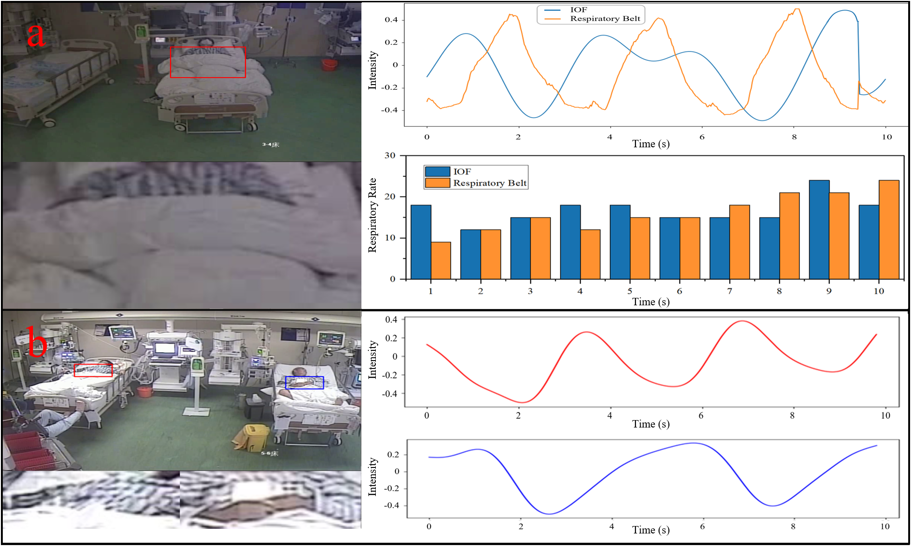

# Lightweight Video-Based Respiration Rate Detection Algorithm: An Application Case on Intensive Care 🪡 (IEEE Transactions on Multimedia)
 

By [Menghan Hu]([https://scholar.google.com.au/citations?user=w_VMopoAAAAJ&hl=en](https://faculty.ecnu.edu.cn/_s15/hmh/main.psp)), [Xudong Tan](https://scholar.google.com/citations?user=6wfIBLgAAAAJ&hl=zh-CN&oi=sra)

## Important Links
- paper: [Lightweight Video-Based Respiration Rate Detection Algorithm: An Application Case on Intensive Care](https://ieeexplore.ieee.org/abstract/document/10158936)  🎉🎉🎉
- dataset: [LBRD-IC-Dataset](https://github.com/ShawnTan86/LBRD-IC-Dataset) 🌟🌟🌟
- demo link: [Scene 1](https://www.youtube.com/watch?v=rpBcFdN-Pbw&t=2s), [Scene 2](https://www.youtube.com/watch?v=tb_ixhTzqvs) 🔥🔥🔥

## A Gentle Introduction
This is a lightweight non-contact respiratory signal detection algorithm suitable for daily use and applicable in ICU scenarios.

